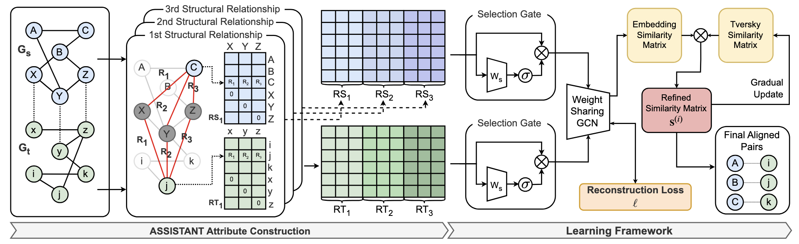
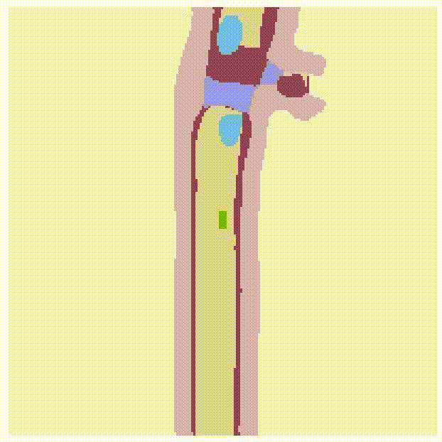

New! 단축키 … 첫 글자를 탐색할 수 있도록 Drive 단축키가 업데이트되었습니다.
---
permalink: /
title: ""
except: ""
author_profile: true
redirect_from: 
  - /about/
  - /about.html
---
About Me
======
I am **Jaehwan Lim**. I received my master degree at Department of Computer Science at **Hanyang University** under supervision of Professor Sangwook Kim.   
My primary interest lies in big data mining based on network alignment and network based recommeder system.  
My research interests are **Network Mining, Network Alignmnet and Recommender System based on User Detection**.

Education
====
* Hanyang University, Seoul, Korea 
  * MS in Computer Science
  * Mar. 2023 - Feb. 2025

* Hong Kong University of Science and Technology
  * BS in Physics
  * Sep. 2016 - Jun. 2022

Work Experience
======

* Big Data Science Lab, Seoul, Korea 
  * Full-time Graduate (Advisor: <a href="https://scholar.google.co.kr/citations?user=ed2vz_oAAAAJ&hl=en">Prof. Sangwook Kim</a>)
  * Mar. 2023 - Feb. 2025 (Expected)
  * Researched on Social Network Analysis especially on Network Alignment
  <!-- * Focused on user relationships in two different social networks to capture common users across different social networks -->

* Dresio Limited, Hong Kong 
  * AI Researcher & Flutter developer (Website: )
  * Mar. 2023 - Sep. 2023  
  * Developed real-time motion tracker, movement classifier for single lens camera which enables real-time biomechanics measurements & analytics
  * Developed mobile application using Flutter to implement real-time motion tracker and classifier

Publications
======
> <i style='font-style: normal;'>**Leveraging Trustworthy Node Attributes for Effective Network Alignment** </i>
>> <i style='font-style: normal;'>Donghyuk Seo, Jaehwan Lim, Wonyong Shin, Sangwook Kim </i>
>> <i style='font-style: normal;'>ACM International Conference on Information and Knowledge Management (**CIKM**), 2024 (Publication date: 21 Oct. 2024). </i>
<!--  -->

>> <i style='font-style: normal;'>
<a href="https://github.com/JaehwanO/ASSISTANT">[Code]</a>

> <i style='font-style: normal;'>**Survey and Analysis on Recent Network Alignment Methods** </i>
>> <i style='font-style: normal;'>**Jaehwan Lim**, Donghyuk Seo, Sangwook Kim </i>
>> <i style='font-style: normal;'>Annual Symposium of KIPS (**ASK**), 2024. </i>

<!-- 

  
  
  

 -->

Projects
======
* Domain Generalizable Anomaly Detection 모델 개발
  * SK-Telecom 산학 프로젝트
  * Sep. 2022 - Feb. 2023 

* Domain Generalizable LiDAR 객체인식 Finetuning Method 개발
  * 현대자동차 산학 프로젝트
  * Sep. 2023 - Jun. 2024

* Mask 불량 검출 이상점 검출 기술 개발
  * 삼성전자 반도체 연구소 산학 프로젝트
  * Feb. 2024 - Jul. 2024

Skills
======
* Python
* Pytorch/Tensorflow
* C++  
* Linux and Shell 
* Flutter
* Git and Docker